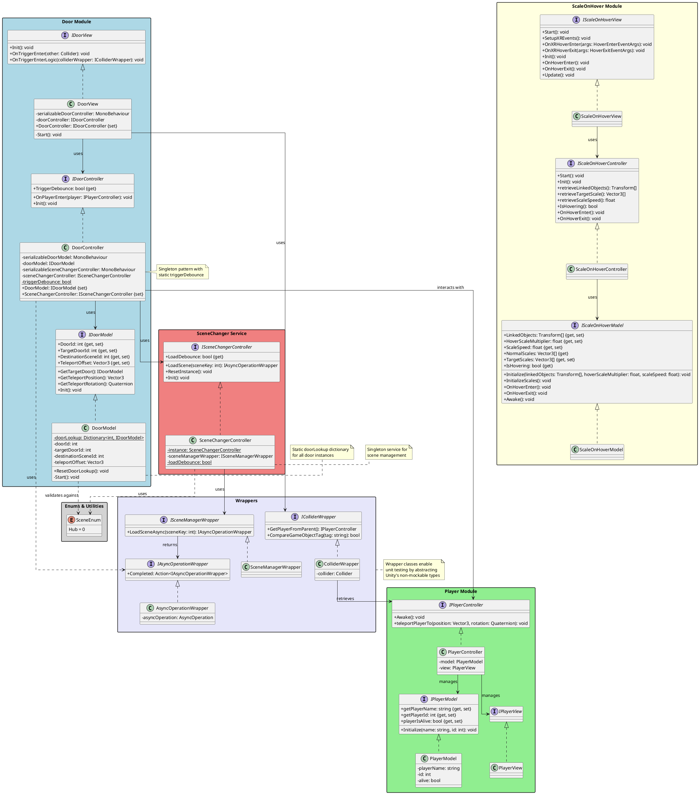

# VRGame - Structural UML Diagram

## Architecture Overview

### Design Patterns Used

1. **MVC (Model-View-Controller)**
   - Door Module: Complete MVC implementation
   - Player Module: Complete MVC implementation
   - ScaleOnHover Module: Complete MVC implementation

2. **Singleton Pattern**
   - SceneChangerController: Persistent singleton service
   - DoorModel: Static lookup table for all doors

3. **Wrapper Pattern**
   - ColliderWrapper, SceneManagerWrapper, AsyncOperationWrapper
   - Purpose: Enable unit testing by wrapping Unity's non-mockable types

### Module Descriptions

#### Door Module
Handles door interactions and scene transitions. When a player enters a door, it:
- Validates the destination scene
- Loads the target scene asynchronously
- Teleports the player to the target door's position

#### Player Module
Manages player state and behavior including:
- Player identification (name, ID)
- Player status (alive/dead)
- Teleportation functionality

#### ScaleOnHover Module
Provides interactive scaling effects for VR objects:
- Detects XR ray interactor hover events
- Smoothly scales linked objects on hover
- Returns to normal scale on hover exit

#### SceneChanger Service
Singleton service managing scene loading:
- Prevents multiple simultaneous scene loads
- Wraps Unity's SceneManager for testability
- Uses async operations for smooth transitions

#### Wrappers
Abstraction layer for Unity types to enable unit testing:
- ColliderWrapper: Wraps Unity Collider
- SceneManagerWrapper: Wraps Unity SceneManager
- AsyncOperationWrapper: Wraps Unity AsyncOperation

### Key Architectural Features

1. **Interface-Driven Design**: All modules use interfaces for loose coupling
2. **Testability**: Wrapper pattern enables comprehensive unit testing
3. **Separation of Concerns**: Clear MVC separation in each module
4. **Unity Integration**: SerializeField wrappers for Unity Inspector compatibility
5. **Type Safety**: Enum-based scene identification
